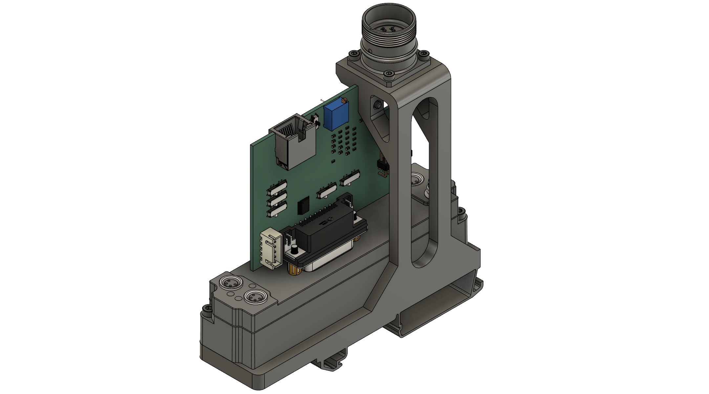

# EP5101 SinCos 11µA_pp and 1V_pp encoder/glass scale converter (WIP! - UNTESTED!)
This interface board is designed to convert a encoder signal with 11µA peak-peak or 1V peak-peak signal to TTL with a [iC-Haus iC-NV](https://www.ichaus.de/product/ic-nv/) be used with a [Beckhoff EP5101](https://www.beckhoff.com/de-de/produkte/i-o/ethercat-box/epxxxx-industriegehaeuse/ep5xxx-winkel-wegmessung/ep5101-0011.html?) for example in LinuxCNC.

Assembly concept:

PCB:\
comming soon...

## ToDo
- 🔲 finished prototype PCB (v0.?)
- 🔲 working conversion
- 🔲 tested intensively with [LS403](docs/Heidenhain-LS-403-LS-403C.pdf) and [EP5101](https://www.beckhoff.com/de-de/produkte/i-o/ethercat-box/epxxxx-industriegehaeuse/ep5xxx-winkel-wegmessung/ep5101-0011.html?)

## Powering and Connectors
The board needs no seperate supply voltage and is fully powered by the 5V supply of the EP5101. The green led of the RJ45 connector indicates a working 5V rail.

## Mounting adaptor
There is a DIN-rail mounting adaptor avaliable, which is used to mount a M23 male connector and a EP5101 onto a 35 mm standard rail. You can find the [files to 3D print](https://thangs.com/designer/PedPEx) it yourself over on my Thangs-account.

## Config switches
Pretty much everything of the [iC-NV](https://www.ichaus.de/product/ic-nv/) is configurable through config switches or a potentiometer. \
A detailed list of all configurable options will be added as soon as the first PCB layout is finished. 

## Terminal blocks, connectors and pinouts
The shielded RJ45 port has the following pinout (pin-matched with the Heidenhain spec for their 9 pin connectors):

| pin RJ45    | usage/signal |
| :---  | :---  |
| 1     | I_1+  |
| 2     | I_1-  |
| 3     | 5 V   |
| 4     | 0 V   |
| 5     | I_2+  |
| 6     | I_2-  |
| 7     | I_0+  |
| 8     | I_0-  |

ToDo:

The 10 pin male-header has the classic Heidenhain pinout. It's possible to use the cable of a Philips 432 triple EXE Board like it is mentioned in the [Limitations Section](#limitations).

| pin header (2x6)  | colour Heidenhain spec  | usage/signal |
| :---  | :----     | :---  |
| 1     | unknown   | unknown  |
| 2     | unknown   | unknown  |
| 3     | unknown   | unknown  |
| 4     | unknown   | unknown  |
| 5     | unknown   | unknown  |
| 6     | unknown   | unknown  |
| 7     | unknown   | unknown  |
| 8     | unknown   | unknown  |
| 9     | unknown   | unknown  |
| 10    | unknown   | unknown  |
| 11    | unknown   | unknown  |
| 12    | unknown   | unknown  |

## Limitations
In our Maho 400E with the original Philips 432/10 controller, the encoder converter card is labeled "Maho 27.69 658" on the top and no label on the bottom. It seems to be a standard Heidenhain part (Part#: 229 281 01). Example pictures are avaliable [here](https://www.cnc-shopping.com/en/philips-432-cnc-heidenhain-229-281-01-exe-platine-maho-27-69-658-3-axis-615dc0edd3849-p-5395.html). 

Keep in mind this adaptor is not suited for use with a standard [Heidenhain EXE 600/900](https://cncbote.de/artikel/heidenhain-exe-600-5-f-id-nr-172680a/) series converter. These need an extra 12 V supply and other connectors.

## Usage/Software
This interface board is meant to be used in combination with the [Beckhoff EP5101 module](hhttps://www.beckhoff.com/de-de/produkte/i-o/ethercat-box/epxxxx-industriegehaeuse/ep5xxx-winkel-wegmessung/ep5101-0011.html?). The EL5021 is then used by the [LinuxCNC software](https://linuxcnc.org/) to read e.g. Heidenhain LS403 glass scales on a Maho MH400E.

## Documentation
All docs can be found in the [docs folder](docs/).

## Online Preview / BOM
[Detailed schematics preview](https://kicanvas.org/?github=https%3A%2F%2Fgithub.com%2FPedPEx%2FSinCosEnc-Conv_EP5101) (KiCanvas)

[Online BOM](https://htmlpreview.github.io/?https://raw.githubusercontent.com/PedPEx/SinCosEnc-Conv_EP5101/master/bom/webviewer-BOM.html)

## *Note*
The pictures were rendered with the help of Blender and the [pcb2blender](https://github.com/30350n/pcb2blender) plugin and the HTML BOM was created with [InteractiveHtmlBom](https://github.com/openscopeproject/InteractiveHtmlBom).
