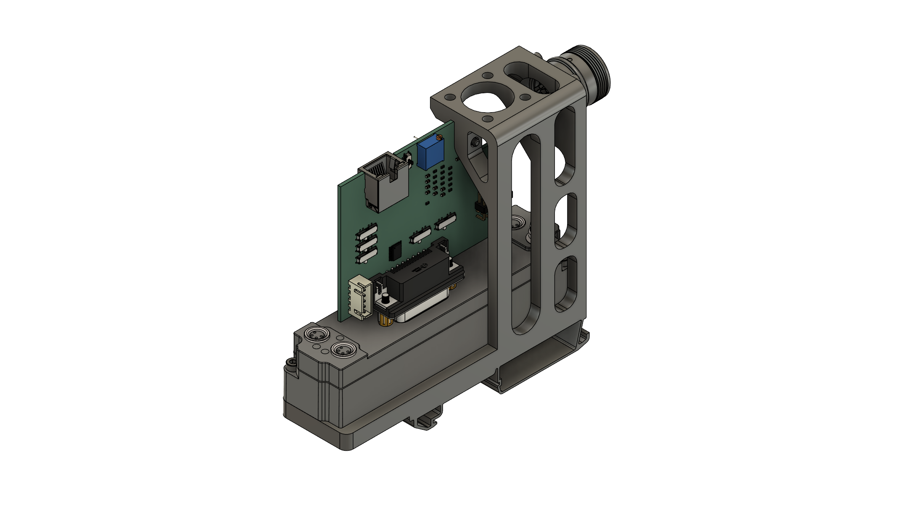
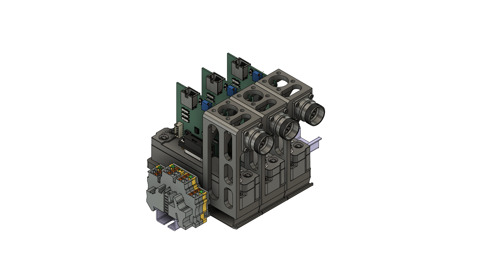

# EP5101 SinCos 11µA_pp and 1V_pp encoder/glass scale converter (WIP! - UNTESTED!)
This interface board is designed to convert a encoder signal with $11µA_{PP}$ (peak-peak) or $1V_{PP}$ signal to TTL with a [iC-Haus iC-NV](https://www.ichaus.de/product/ic-nv/) be used with a [Beckhoff EP5101](https://www.beckhoff.com/de-de/produkte/i-o/ethercat-box/epxxxx-industriegehaeuse/ep5xxx-winkel-wegmessung/ep5101-0011.html?) for example in LinuxCNC.

Assembly concept:



PCB:\
comming soon...


## ToDo
- 🔲 finished prototype PCB (v0.?)
- 🔲 working conversion
- 🔲 tested intensively with [LS403](docs/Heidenhain-LS-403-LS-403C.pdf) and [EP5101](https://www.beckhoff.com/de-de/produkte/i-o/ethercat-box/epxxxx-industriegehaeuse/ep5xxx-winkel-wegmessung/ep5101-0011.html?)


## Powering, connectors and signals
The board needs no seperate supply voltage and is fully powered by the 5V supply of the EP5101. The green led of the RJ45 connector indicates a working 5V rail.
Supported input signals are $11µA_{PP}$ (standard) and $1V_{PP}$. The output is a TTL signal. With component ```U2``` ([AM26LS31](https://www.ti.com/product/de-de/AM26LS31) - Differential Line Driver) placed a placed 


## Mounting adaptor
There is a DIN-rail mounting adaptor avaliable, which is used to mount a M23 male connector and a EP5101 onto a 35 mm standard rail. You can find the [files to 3D print](https://than.gs/m/1345234) it yourself over on my Thangs-account.


## Config switches
Pretty much everything of the [iC-NV](https://www.ichaus.de/product/ic-nv/) is configurable through config switches and a potentiometer. \
A detailed list of all configurable options will be added as soon as the first PCB layout is finished. 


## Terminal blocks, connectors and pinouts
The shielded RJ45 port has the following pinout (pin-matched with the Heidenhain spec for their 9 pin connectors):

| pin RJ45 | usage/signal |
| :---  | :---      |
| 1     | In_SIN+   |
| 2     | In_SIN-   |
| 3     | 5 V       |
| 4     | 0 V       |
| 5     | In_COS+   |
| 6     | In_COS-   |
| 7     | In_ZERO+  |
| 8     | In_ZERO-  |

The 8 pin male-header J2 has the following pinout:

```
                        odd pins  |  even pins
╔════╦════╗             ----------|------------
║  1 ║  2 ║════════      In_SIN+  |  In_SIN-
╠════╬════╣                       |
║  3 ║  4 ║════════          5 V  |  GND
╠════╬════╣                       |
║  5 ║  6 ║════════      In_COS+  |  In_COS-
╠════╬════╣                       |
║  7 ║  8 ║════════     In_ZERO+  |  In_ZERO-
╠════╬════╣                       |
║  9 ║ 10 ║════════       shield  |  shield
╚════╩════╝
```

## Analog Frontend / Signal Conditioning Stage
After reaching out to iC-Haus' support for some details about the needed analog frontend for $11 µA_{PP}$ sensors, i got some details on how to implement it. A really nice solution which works with $1 V_{PP}$ as well as $11 µA_{PP}$ signals was documented in the [iC-NQC datasheet (page 28)](docs/iC-NQC_datasheet_E2en.pdf). This exact signal conditioning stage was implemented for all three stages. By shorting each ```CHx_JP1``` you can connect the $120 \Omega$ termination resistor to the input side of the input stage and by that set the device to its $1 V_{PP}$ operating mode.


## Usage/Software
This interface board is meant to be used in combination with the [Beckhoff EP5101 module](hhttps://www.beckhoff.com/de-de/produkte/i-o/ethercat-box/epxxxx-industriegehaeuse/ep5xxx-winkel-wegmessung/ep5101-0011.html?). The EL5021 is then used by the [LinuxCNC software](https://linuxcnc.org/) to read e.g. Heidenhain LS403 glass scales on a Maho MH400E.

Also keep in mind that you need a sufficiently sized counter. For most retrofits a 16 bit wide counter will not cut it. 
Quick example:
```math 
n_{min} = \log_2 \left(\frac{range~of~motion}{axis~resolution}\right) = \log_2 \left(\frac{400 mm}{1 \mu m}\right) = 18.61 bit \approx \textbf{19 bit > 16 bit}
```


## Documentation
All docs can be found in the [docs folder](docs/).


## Online Preview / BOM
[Detailed schematics preview](https://kicanvas.org/?github=https%3A%2F%2Fgithub.com%2FPedPEx%2FSinCosEnc-Conv_EP5101) (KiCanvas)

[Online BOM](https://htmlpreview.github.io/?https://raw.githubusercontent.com/PedPEx/SinCosEnc-Conv_EP5101/master/bom/webviewer-BOM.html)


## *Note*
The pictures were rendered with the help of Blender and the [pcb2blender](https://github.com/30350n/pcb2blender) plugin and the HTML BOM was created with [InteractiveHtmlBom](https://github.com/openscopeproject/InteractiveHtmlBom).