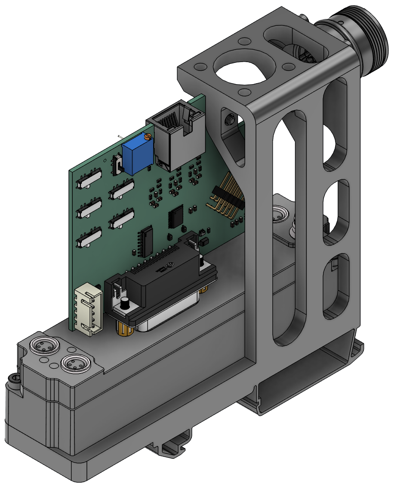
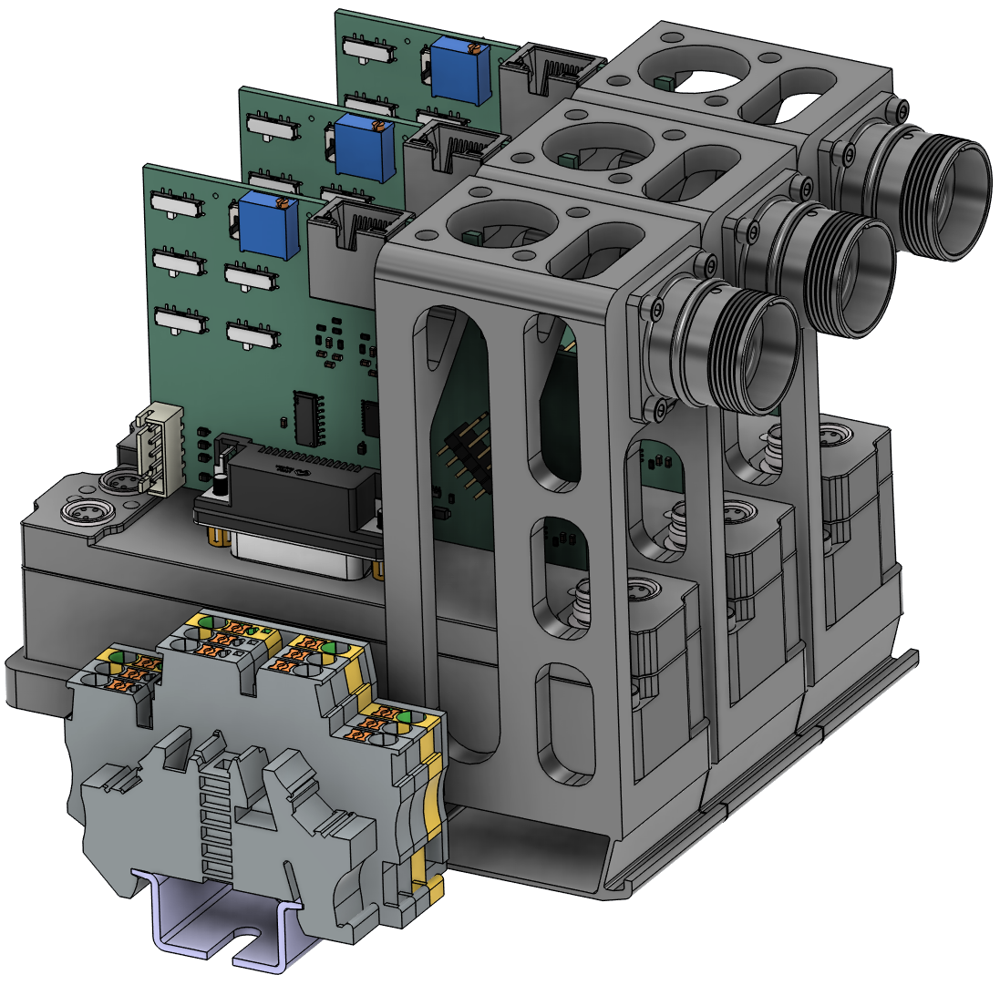
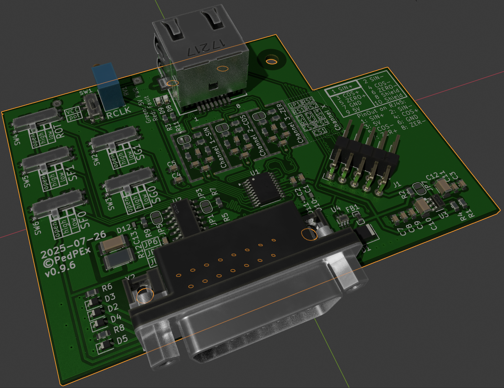
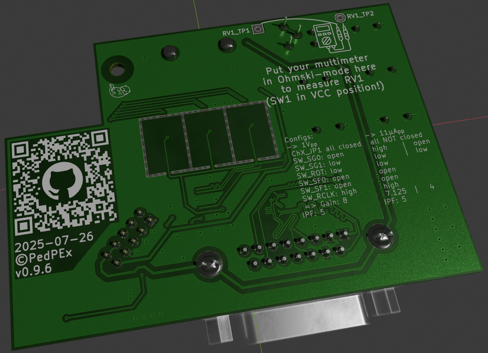
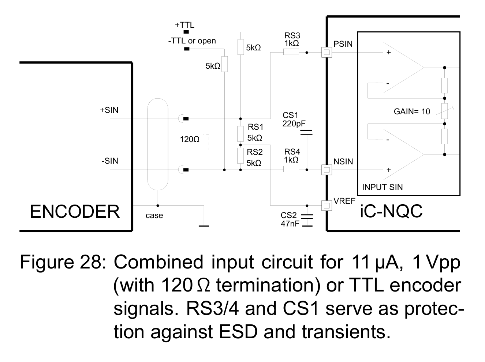

# EP5101 SinCos $11µA_{PP}$ and $1V_{PP}$ encoder/glass scale to TTL (RS422 compliance) converter (WIP! - UNTESTED!)
This interface board is designed to convert a encoder signal with $11µA_{PP}$ (peak-peak) or $1V_{PP}$ signal to TTL with a [iC-Haus iC-NV](https://www.ichaus.de/product/ic-nv/) be used with a [Beckhoff EP5101](https://www.beckhoff.com/de-de/produkte/i-o/ethercat-box/epxxxx-industriegehaeuse/ep5xxx-winkel-wegmessung/ep5101-0011.html?) for example in LinuxCNC.

Assembly concept (with old potentiometer and RJ45 jack):

Single encoder input             |  Three encoder inputs with terminal blocks
:-------------------------:|:-------------------------:
  |  

PCB:\




## ToDo
- ✅ finished prototype PCB (v0.9.6)
- 🔲 working conversion
- 🔲 tested intensively with [LS403](docs/Heidenhain-LS-403-LS-403C.pdf) and [EP5101](https://www.beckhoff.com/de-de/produkte/i-o/ethercat-box/epxxxx-industriegehaeuse/ep5xxx-winkel-wegmessung/ep5101-0011.html?)


## Powering, connectors and signals
The board needs no seperate supply voltage and is fully powered by the 5V supply of the EP5101. The green led indicates a working 5V sensor rail. Supported input signals are $11µA_{PP}$ (standard) and $1V_{PP}$. By default, the output is a differential RS422 TTL-encoder signal. In that case, component ```U2``` ([AM26LS31](https://www.ti.com/product/de-de/AM26LS31) - Differential Line Driver) is populated on the PCB. By removing ```U2``` and either manualy shorting ```JP1 - JP6``` or populating ```R5 - R10``` with $0 \Omega$ resistors (manual adjustment of BOM is required). 

Because the [Beckhoff EL5101](https://www.beckhoff.com/de-de/produkte/i-o/ethercat-klemmen/el5xxx-winkel-wegmessung/el5101.html) is way more common than the EP5101, a 3D printable holder is in the works and will also be added to the repo, as soon as it has reached a usable state. 

There could also be a master-PCB, which would be used in standalone use or with a Mesa FPGA board. This master-PCB would need a 24V to 5V regulator and three DSUB15 female connectors in order to connect to the interpolator PCBs and three connectors (RJ45 eventually?) to connect the TTL signals to the Mesa encoder inputs. A integrated DIN rail mount would make mounting easy. In case there is interest in such a board, feel free to open a issue and i will design one. 


## Mounting adaptor
There is a DIN-rail mounting adaptor avaliable, which is used to mount a M23 male connector and a EP5101 onto a 35 mm standard rail. You can find the [files to 3D print](https://than.gs/m/1345234) it yourself over on my Thangs-account.


## Config switches
Pretty much everything of the [iC-NV](https://www.ichaus.de/product/ic-nv/) is configurable through config switches and a potentiometer ($50 k\Omega$). The two most common configs are printed on the backside of the PCB

## Terminal blocks, connectors and pinouts
The shielded DSUB15 port has the following pinout:

| pin DSUB15 | usage/signal |
| :---  | :---      |
| 1     | DifSig_A+ / TTL_A   |
| 2     | GND   |
| 3     | DifSig_B+ / TTL_B   |
| 4     | 5V VCC   |
| 5     | n.c.   |
| 6     | n.c.       |
| 7     | DifSig_C- / TTL_GND  |
| 8     | n.c.  |
| 9     | DifSig_A- / TTL_GND  |
| 10    | GND  |
| 11    | DifSig_B- / TTL_GND  |
| 12    | 5V VCC  |
| 13    | E̅R̅R̅O̅R̅ out |
| 14    | DifSig_C+ / TTL_B  |
| 15    | n.c.  |

The shielded RJ45 port has the following pinout:

| pin RJ45 | usage/signal |
| :---  | :---      |
| 1     | In_SIN+   |
| 2     | In_SIN-   |
| 3     | +5 V      |
| 4     | In_COS+   |
| 5     | In_COS-   |
| 6     | GND       |
| 7     | In_ZERO+  |
| 8     | In_ZERO-  |

The 8 pin male-header J2 has the following pinout (standard Heidenhain pinout):

```
                        odd pins  |  even pins
╔════╦════╗             ----------|------------
║  1 ║  2 ║════════      In_SIN+  |  In_SIN-
╠════╬════╣                       |
║  3 ║  4 ║════════      In_COS+  |  In_COS-
╠════╬════╣                       |
║  5 ║  6 ║════════     In_ZERO+  |  In_ZERO-
╠════╬════╣                       |
║  7 ║  8 ║════════          GND  |  Shield
╠════╬════╣                       |
║  9 ║ 10 ║════════          +5V  |  Shield
╚════╩════╝
```

*Note:*\
DO ONLY CONNECT ONE SENSOR INPUT! NEVER USE THE PINHEADER AND RJ45 SIMULTANEOUSLY!

## Analog Frontend / Signal Conditioning Stage
After reaching out to iC-Haus' support for some details about the needed analog frontend for $11 µA_{PP}$ sensors, i got some details on how to implement it. A really nice solution which works with $1 V_{PP}$ as well as $11 µA_{PP}$ signals was documented in the [iC-NQC datasheet (page 28)](docs/iC-NQC_datasheet_E2en.pdf). This exact signal conditioning stage was implemented for all three stages. By shorting each ```CHx_JP1``` you can connect the $120 \Omega$ termination resistor to the input side of the input stage and by that set the device to its $1 V_{PP}$ operating mode.




## Usage/Software
This interface board is meant to be used in combination with the [Beckhoff EP5101 module](hhttps://www.beckhoff.com/de-de/produkte/i-o/ethercat-box/epxxxx-industriegehaeuse/ep5xxx-winkel-wegmessung/ep5101-0011.html?). The EP5101 is then used by the [LinuxCNC software](https://linuxcnc.org/) to read e.g. Heidenhain LS403 glass scales on a Maho MH400E.

A adaptor/mounting kit is in the works, that this project can also be used with [Beckhoffs EL5101](https://www.beckhoff.com/de-de/produkte/i-o/ethercat-klemmen/el5xxx-winkel-wegmessung/el5101.html) encoder inputs.

Also keep in mind that you need a sufficiently sized counter. For most retrofits a 16 bit wide counter will not cut it. 
Quick example:
```math 
n_{min} = \log_2 \left(\frac{range\_of\_motion}{axis\_resolution}\right) = \log_2 \left(\frac{400 mm}{1 \mu m}\right) = 18.61 bit \approx \textbf{19 bit > 16 bit}
```
In addition to the resolution you you also need to check the cutoff frequency (maximum input frequency) of the encoder input. The ```EP5101-0011``` for example is limited to $1.0 MHz$ (that's really high, especally in fourfold evaluation mode). For a resolution of $1 µm$ the maximum axis speed is:
```math
v_{max\_EC-Input} = \frac{resolution\_of\_sensor}{interpolation\_factor \cdot quadratur\_encoder\_input} \cdot cutoff\_frequency = {overall\_resolution \cdot cutoff\_frequency} = \frac{20µm}{5 \cdot 4} \cdot 1.0 MHz = 1µm \cdot 1.0 MHz = 1.0 \frac{m}{s}
```
The same calculation needs to be done with the input side of the IC ```iC-NV```. The cutoff frequency depends on the used gain. For a $gain = 4$ the manual states a $fin_{MAX}=200 kHz$ (for RCLK = VCC).
```math
v_{max\_IC-Input} = resolution\_of\_sensor \cdot cutoff\_frequency_{IC} = 20µm \cdot 200 kHz = 4.0 \frac{m}{s}
```
The lower value of the two calculated velocities, $v_{max\_EC-Input} = 1.0 \frac{m}{s}$ and $v_{max\_IC-Input} = 4.0 \frac{m}{s}$, is $1.0 \frac{m}{s}$. This represents the maximum permissible speed for the corresponding axis and must not be exceeded!

## Documentation
All docs can be found in the [docs folder](docs/).


## Online Preview / BOM
[Detailed schematics preview](https://kicanvas.org/?github=https%3A%2F%2Fgithub.com%2FPedPEx%2FSinCosEnc-Conv_EP5101) (KiCanvas)

[Online BOM](https://htmlpreview.github.io/?https://raw.githubusercontent.com/PedPEx/SinCosEnc-Conv_EP5101/master/bom/webviewer-BOM.html)

[PDF schematics (v0.9.6)](https://github.com/PedPEx/SinCosEnc-Conv_EP5101/blob/master/SinCosEnc-Converter_EP5101-0011_schematic_v0.9.6.pdf)


## *Note*
The pictures were rendered with the help of Blender and the [pcb2blender](https://github.com/30350n/pcb2blender) plugin and the HTML BOM was created with [InteractiveHtmlBom](https://github.com/openscopeproject/InteractiveHtmlBom).